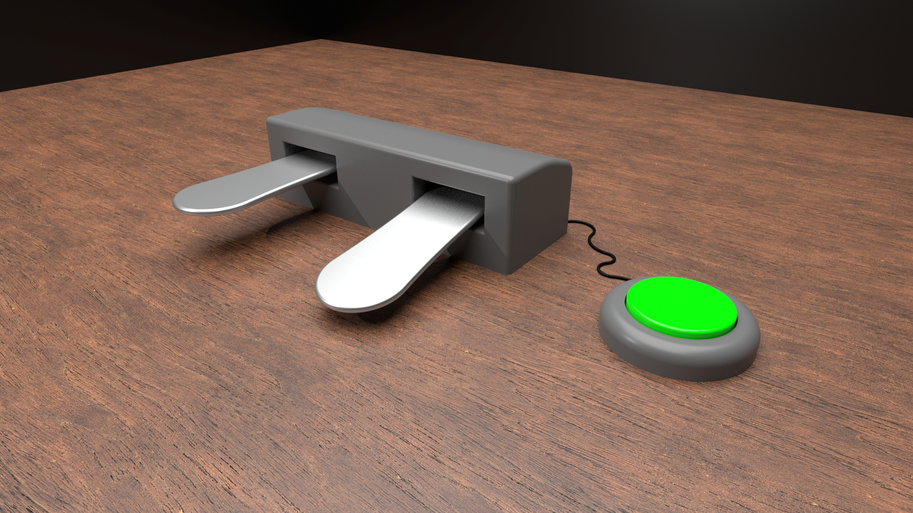

# Feel The Score
*Ontwikkelen van een handsfree, toegankelijk systeem dat slechtzienden en blinden helpt muziek intuïtief te leren en te spelen zonder afhankelijk te zijn van traditionele braillepartituren.* 

🛠️ Built by ``Kobe Holderbeke`` & ``Mattea Claeys``   
🔥 Supervised by ``prof. dr. Bas Baccarne``, ``Yannick Christiaens`` & ``Wouter Devriese``    
🌱 Grown at ``Ghent University`` 🏛️ ``Industrial Design Engineering`` ([project overview](https://github.com/basbaccarne/human-centered-design))       

*13/11/2025*   

## Samenvatting
### Probleem 

Slechtziende muzikanten stuiten op grote drempels bij het leren van nieuwe muziek. Braille-bladmuziek is namelijk een complexe, aparte taal die velen niet beheersen. Bovendien moeten muzikanten hun instrument constant loslaten om handmatig door braille-partituren te navigeren, wat de flow onderbreekt en frustratie uitlokt. 

### Onderzoek 

Dit probleem werd vastgesteld via een interview (N = 1). De interviewee stelde: “Ik heb dat (Braille Muziekschrift) wel geleerd, maar ik blijf er zoveel mogelijk van af”. Deze persoon speelt als alternatief de muzikale audiotrack af en leert het doormiddel van perfect pitch*.  

Er blijkt behoefte te zijn aan een efficiënte, handsfree leermethode.

### Oplossing 

Het antwoord op dit probleem is om de muziek in audiovorm, zijnde dat de muziek track of de audio partituur, controleerbaar te maken door de voeten, doormiddel van een slim product. 

### Impact 

Dit neemt zowel de kloof van het leren van een nieuwe taal weg, alsook de frustratie van het loslaten van het instrument, met als hoop het leerproces aangenamer te maken en meer slechtziende mensen aan te zetten om muziek te leren.  

*perfect pitch: Het vermogen om een ​​bepaalde toonhoogte te identificeren of na te bootsen zonder gebruik te maken van een referentietoon.  

 

  

---

## Introductie
Dit project ging van start met een algemene challenge: “Spacial Experiences for Visually Impaired Populations”, het ontwikkelen van een slim product dat slechtzienden assisteert in een vorm van ruimtelijke oriëntatie.  

Er wordt gebruikgemaakt van een zekere methode (zie Methodologie), welke het ontwerpproces opdeelt in vaste fasen.  

Tijdens de eerste fase, Discovery, is binnen het ruime probleem (afgeleid uit de challenge), gezocht naar een specifieker deelprobleem: 

.jpg).

Dit specifieker probleem kadert het project niet rond het vervullen van basisnoden zoals oriëntatie/koken/…, maar wel rond het ondersteunen van ontspanning en zelfexpressie voor slechtziende (aspirant-)muzikanten, door het leerproces van muziek voor hen aangenamer te maken. 
Het brengt volgende hoofddoelen met zich mee:
-	De gebruiker heeft geen kennis van een andere taal nodig, buiten notenleer.
-	De gebruiker moet tijdens het leren het instrument niet loslaten.
-	De gebruiker kan zowel een muziektrack als een audio partituur bedienen.
-	De (eventuele) bijhorende app moet voor slechtzienden toegankelijk zijn.

Ook de boundary conditions:
-	Het product signaleert gebruiksaspecten nooit enkel op visuele wijze.
-	Alle fasen moeten binnen de voorziene deadline (zie Methodologie) afgewerkt worden.
Aan de hand hiervan wordt in de volgende fase, Definition, nagedacht over hoe dit probleem het best kan opgelost worden. Uit inzichten van deze fase alsook uit de volgende fasen, worden zekere eisen geformuleerd waaraan het product moet voldoen (ook in welke mate noodzakelijk), namelijk de Design requirements en ook welke materialen het best gebruikt worden en waar deze aangekocht worden, namelijk de een Bill of materials.

---

## Inhoudstafel

1. [Methodologie](./docs/methodologie.md)
2. [Discovery](./docs/discovery.md)
3. [Defintion](./docs/definition.md)
4. [Develop phase 1](./docs/Develop_1.md)
5. [Design Requirements](./docs/design_requirements.md)
6. [Bill of materials](./docs/bom.md)

## Kritische reflectie
Max. 500 woorden

## Noot inzake het gebruik van AI
In dit project werd AI gebruikt voor spellings/grammatica controles van teksten en het omzetten van excel tabellen naar github tabellen.
## Bijlagen
### Discovery
* Literatuuronderzoek (N=10)
  * [Protocol](https://ugentbe.sharepoint.com/:w:/t/Group.course1292876/IQB8WhhhP_pdSazPReRh-HxqAclnc3PnnkJyJq7oPYJ3NZ4?e=7g2boN)
  * [Rapport](https://ugentbe.sharepoint.com/:w:/t/Group.course1292876/IQB9HzvLZPKqSpc1Ftse8O0QARGRsxfzFwpFhsLdyy_mlFo?e=11EF0i)
* Interviews (N=3)
  * [Protocol](https://ugentbe.sharepoint.com/:w:/t/Group.course1292876/IQBQU56AthNHTY_BFFeUUjxmASiolwOdjGJiTEfFOpEcLPk?e=OsEMhK)
  * [Rapport](https://ugentbe.sharepoint.com/:w:/t/Group.course1292876/IQBf38VezsivToBSrIhYCN61AUVMqxSsOoYWdKP_1LEdgZQ?e=FsCly7)
    
### Definition
* User testing wave 1 (N=1)
  * [Protocol](https://ugentbe.sharepoint.com/:w:/t/Group.course1292876/IQCpgV68K8tYTbwqrU3BGaQVAbbZWw5pqcu_k0QDw4POE8I?e=BGHP7T)
  * [Rapport](https://ugentbe.sharepoint.com/:w:/t/Group.course1292876/IQAky_YwA6__RZtaeOcWHPhpASCxieU0GRjqjp9feo6laxo?e=5y6nlD)
* User testing wave 2 (N=1)
  * [Protocol](https://ugentbe.sharepoint.com/:w:/t/Group.course1292876/IQBjjLZSffDoT4YwZDXaZOrhAfhvxaoLlUYGOMogOBo6GUY?e=pMHGh2)
  * [Rapport](https://ugentbe.sharepoint.com/:w:/t/Group.course1292876/IQBcQqR74zqURJhRp2q5rA2XAcczsUglUP6ll5FD3lllPYg?e=BxCLvT)

 ### Develop phase 1
* User testing wave 1 (N=2)
  * [Protocol]
  * [Rapport]

## Licentie

This repository contains both software and design materials created as part of an industrial design energineering project at Ghent University.

- **Software and code:** [MIT License](./LICENSE-MIT)  
- **Design, documentation, CAD, and media:** [CC BY 4.0 License](./LICENSE)
  
You are free to reuse and build upon this work, both commercially and non-commercially, as long as proper attribution is given to the original authors.

## Bronnen
 JohnSmith981. (2025, 7 december). *Absolute pitch*. In Wikipedia. https://en.wikipedia.org/wiki/Absolute_pitch
