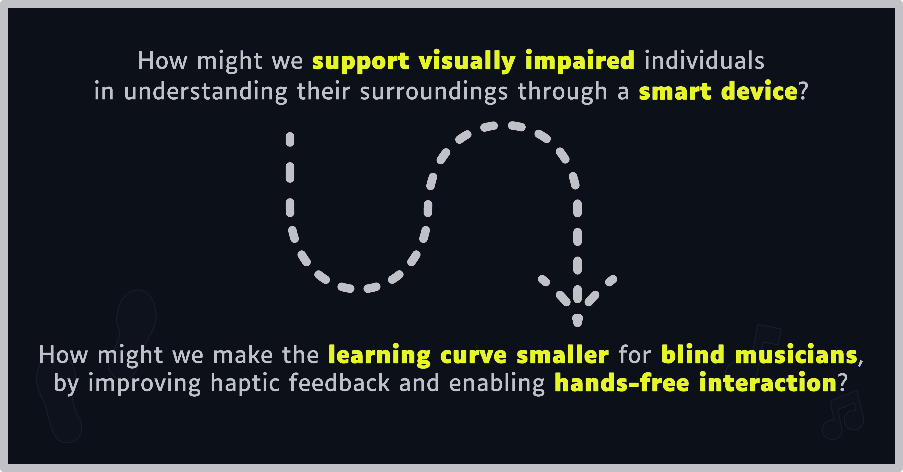

# Feel The Score
*Ontwikkelen van een handsfree, toegankelijk systeem dat slechtzienden en blinden helpt muziek intuïtief te leren en te spelen zonder afhankelijk te zijn van traditionele braillepartituren.* 

🛠️ Built by ``Kobe Holderbeke`` & ``Mattea Claeys``   
🔥 Supervised by ``prof. dr. Bas Baccarne``, ``Yannick Christiaens`` & ``Wouter Devriese``    
🌱 Grown at ``Ghent University`` 🏛️ ``Industrial Design Engineering`` ([project overview](https://github.com/basbaccarne/human-centered-design))       

*13/11/2025*   

## Samenvatting
### Probleem 

Slechtziende muzikanten stuiten op grote drempels bij het leren van nieuwe muziek. Braille-bladmuziek is namelijk een complexe, aparte taal die velen niet beheersen. Bovendien moeten muzikanten hun instrument constant loslaten om handmatig door braille-partituren te navigeren, wat de flow onderbreekt en frustratie uitlokt. 

### Onderzoek 

Dit probleem werd vastgesteld via een interview (N = 1). De interviewee stelde: “Ik heb dat (Braille Muziekschrift) wel geleerd, maar ik blijf er zoveel mogelijk van af”. Deze persoon speelt als alternatief de muzikale audiotrack af en leert het doormiddel van perfect pitch*.  

Er blijkt behoefte te zijn aan een efficiënte, handsfree leermethode.

### Oplossing 

Het antwoord op dit probleem is om de muziek in audiovorm, zijnde dat de muziek track of de audio partituur, controleerbaar te maken door de voeten, doormiddel van een slim product. 

### Impact 

Dit neemt zowel de kloof van het leren van een nieuwe taal weg, alsook de frustratie van het loslaten van het instrument, met als hoop het leerproces aangenamer te maken en meer slechtziende mensen aan te zetten om muziek te leren.  

*perfect pitch: Het vermogen om een ​​bepaalde toonhoogte te identificeren of na te bootsen zonder gebruik te maken van een referentietoon.  

 

---

## Introductie
Dit project ging van start met een algemene challenge: “Spacial Experiences for Visually Impaired Populations”, het ontwikkelen van een slim product dat slechtzienden assisteert in een vorm van ruimtelijke oriëntatie.  

Er wordt gebruikgemaakt van een zekere methode (zie [Methodologie](./docs/methodologie.md)), welke het ontwerpproces opdeelt in vaste fasen.  

Tijdens de eerste fase, [Discovery](./docs/discovery.md), is binnen het ruime probleem (afgeleid uit de challenge), gezocht naar een specifieker deelprobleem: 

Dit specifieker probleem kadert het project niet rond het vervullen van basisnoden zoals oriëntatie/koken/…, maar wel rond het ondersteunen van ontspanning en zelfexpressie voor slechtziende (aspirant-)muzikanten, door het leerproces van muziek voor hen aangenamer te maken. 
Het brengt volgende hoofddoelen met zich mee:
-	De gebruiker heeft geen kennis van een andere taal nodig, buiten notenleer.
-	De gebruiker moet tijdens het leren het instrument niet loslaten.
-	De gebruiker kan zowel een muziektrack als een audio partituur bedienen.
-	De (eventuele) bijhorende app moet voor slechtzienden toegankelijk zijn.

Ook de boundary conditions:
-	Het product signaleert gebruiksaspecten nooit enkel op visuele wijze.
-	Alle fasen moeten binnen de voorziene deadline (zie [Methodologie](./docs/methodologie.md)) afgewerkt worden.
Aan de hand hiervan wordt in de volgende fase, [Defintion](./docs/definition.md), nagedacht over hoe dit probleem het best kan opgelost worden. Uit inzichten van deze fase alsook uit de volgende fasen, worden zekere eisen geformuleerd waaraan het product moet voldoen (ook in welke mate noodzakelijk), namelijk de [Design Requirements](./docs/design_requirements.md) en ook welke materialen het best gebruikt worden en waar deze aangekocht worden, namelijk de een [Bill of materials](./docs/bom.md).

---

## Inhoudstafel

1. [Methodologie](./docs/methodologie.md)
2. [Discovery](./docs/discovery.md)
3. [Defintion](./docs/definition.md)
4. [Develop phase 1](./docs/Develop_1.md)
5. [Develop phase 2: Antropometrische analyse deel 1](./docs/Develop_phase_2:Antropometrie.md)
6. [Develop phase 2: Antropometrische analyse deel 2](./docs/Antropometrie2.md)
7. [Develop phase 2: Antropometrische analyse deel 3](./docs/Antropo3.md)
8. [Develop phase 2: Prototypes resultaten](./docs/DEV2result.md)
9. [Develop phase 2: Cognitieve analyse](./docs/CognitieveAnalyse.md)
10. [Develop phase 3: CMF Analyse](./docs/CMFanalyse.md)
11. [Develop phase 3: PESTEL Analyse](./docs/PESTELanalyse.md)
12. [Develop phase 3: Resultaten](./docs/DEV3results.md)
13. [Design Requirements](./docs/design_requirements.md)
14. [Bill of materials](./docs/bom.md)

## Conclusie

Het finale concept is een toegankelijke voetcontroller met bijhorende theoretisch uitgewerkte app die blinde en slechtziende muzikanten ondersteunt tijdens het zelfstandig oefenen. De controller maakt het mogelijk om een audio-partituur of muziekfragment te bedienen zonder de handen van het instrument te halen. Functies zoals pauzeren, hervatten, terugspoelen, doorspoelen en herhalen blijven daardoor bereikbaar tijdens het musiceren.

De keuze voor voetbediening sluit goed aan bij de muzikale context. Veel muzikanten zijn al vertrouwd met het gebruik van pedalen, waardoor deze manier van bedienen natuurlijker aanvoelt dan extra knoppen op een scherm of handmatige bediening. Het product vertrekt dus niet vanuit een volledig nieuwe interactie, maar bouwt verder op een handeling die binnen muziek al herkenbaar is.

De fysieke vormgeving is afgestemd op gebruik zonder zicht. Tactiel onderscheidbare knoppen, duidelijke voetpositionering, verstelbare muren, gripvaste materialen en een stabiele bodemplaat zorgen ervoor dat oriëntatie via gevoel mogelijk wordt. Ook de app ondersteunt toegankelijk gebruik door eenvoudige functies, duidelijke structuur en auditieve ondersteuning. Deze keuzes sluiten aan bij de opgestelde [design requirements](docs/design_requirements.md).

Dit concept vormt een sterke oplossing voor het eerder geschetste probleem, omdat het zelfstandigheid, gebruiksgemak en muzikale continuïteit combineert. Tijdens het oefenen ontstaat minder nood aan onderbreking of hulp van buitenaf. Tegelijk blijft het product bewust beperkt tot de belangrijkste functies, waardoor de bediening overzichtelijk blijft en de cognitieve belasting laag blijft.

Naast toegankelijkheid werd ook rekening gehouden met praktische aspecten zoals betaalbaarheid, robuustheid, onderhoud, transport en instelbaarheid voor verschillende lichaamsmaten. Het inklapbare ontwerp en de geïntegreerde handvaten maken het product bruikbaar in een thuis-, school- of oefencontext. Verdere validatie blijft nodig rond langdurig gebruik, materiaalkeuze, knopweerstand en exacte positionering van de bedieningselementen. Toch biedt dit finale concept een geloofwaardige en onderbouwde richting voor een toegankelijk hulpmiddel binnen muziekeducatie.

## Kritische reflectie
De samenwerking binnen de groep verliep vlot en de taken konden goed verdeeld worden. Daardoor konden verschillende onderdelen van het project tegelijk worden uitgewerkt, zoals onderzoek, prototyping, testen en documentatie. Toch had een vroegere planning het proces kunnen versterken, vooral bij het zoeken naar geschikte testpersonen.

Een belangrijke beperking was het beperkte aantal gebruikerstesten. Blinde en slechtziende muzikanten vormen een specifieke doelgroep die moeilijk te bereiken is. De testresultaten leverden daardoor waardevolle inzichten op, maar kunnen niet als volledig representatief gezien worden.

Ook het prototype vraagt nog verdere uitwerking en validatie. Vooral langdurig gebruik, knopweerstand, materiaalkeuze, stabiliteit en app-toegankelijkheid moeten verder getest worden. Daarnaast zijn de app en de render (foto bovenaan de main-page) voorlopig vooral conceptueel uitgewerkt. In een volgende fase kunnen deze onderdelen concreter gebouwd, getest en verfijnd worden. Het concept toont wel aan dat een handsfree voetcontroller een sterke richting kan zijn om zelfstandiger met audio-partituren te oefenen.

## Noot inzake het gebruik van AI
In dit project werd AI gebruikt voor spellings/grammatica controles van teksten en het omzetten van excel tabellen naar github tabellen. In hoofdstukken waarin AI voor andere doeleinden is gebruikt, wordt dit in het hoofdstuk zelf vermeld.

## Bijlagen

Voor een goede view van de bijlagen is openen van word bestanden in de desktop app aangeraden.

### Discovery
* Literatuuronderzoek (N=10)
  * [Protocol](https://ugentbe.sharepoint.com/:w:/t/Group.course1292876/IQB8WhhhP_pdSazPReRh-HxqAclnc3PnnkJyJq7oPYJ3NZ4?e=7g2boN)
  * [Rapport](https://ugentbe.sharepoint.com/:w:/t/Group.course1292876/IQB9HzvLZPKqSpc1Ftse8O0QARGRsxfzFwpFhsLdyy_mlFo?e=11EF0i)
* Interviews (N=3)
  * [Protocol](https://ugentbe.sharepoint.com/:w:/t/Group.course1292876/IQBQU56AthNHTY_BFFeUUjxmASiolwOdjGJiTEfFOpEcLPk?e=OsEMhK)
  * [Rapport](https://ugentbe.sharepoint.com/:w:/t/Group.course1292876/IQBf38VezsivToBSrIhYCN61AUVMqxSsOoYWdKP_1LEdgZQ?e=FsCly7)
    
### Definition
* User testing wave 1 (N=1)
  * [Protocol](https://ugentbe.sharepoint.com/:w:/t/Group.course1292876/IQCpgV68K8tYTbwqrU3BGaQVAbbZWw5pqcu_k0QDw4POE8I?e=BGHP7T)
  * [Rapport](https://ugentbe.sharepoint.com/:w:/t/Group.course1292876/IQAky_YwA6__RZtaeOcWHPhpASCxieU0GRjqjp9feo6laxo?e=5y6nlD)
* User testing wave 2 (N=1)
  * [Protocol](https://ugentbe.sharepoint.com/:w:/t/Group.course1292876/IQBjjLZSffDoT4YwZDXaZOrhAfhvxaoLlUYGOMogOBo6GUY?e=pMHGh2)
  * [Rapport](https://ugentbe.sharepoint.com/:w:/t/Group.course1292876/IQBcQqR74zqURJhRp2q5rA2XAcczsUglUP6ll5FD3lllPYg?e=BxCLvT)

 ### Develop phase 1
* User testing (N=3)
  * [Protocol](https://ugentbe.sharepoint.com/:w:/t/Group.course1292876/IQAjbiEWOX_lQ4XXfaun0UtAAUon7dIECnejuIu1gmOtWKU?e=WpIFe5)
  * [Rapport 1](https://ugentbe.sharepoint.com/:w:/t/Group.course1292876/IQDN2bwuJPMMSLmgR1tbd45yAW7m6enV3AymeFjA8X_QwLY?e=4EHN3X)
  * [Rapport 2](https://ugentbe.sharepoint.com/:w:/t/Group.course1292876/IQC0vbEEvfZeQ49qQybeRaqQAQ82UMk618w59HhCXBCYtpQ?e=vUupAp)

 ### Develop phase 2
* User testing (N=2)
  * [Protocol](https://ugentbe.sharepoint.com/:w:/t/Group.course1292876/IQApzxOackPtQ5DfW1NZEpZ_AazlX7PwUC5u7cyfCQHkbIs?e=VCITgi)
  * [Rapport](https://ugentbe.sharepoint.com/:w:/t/Group.course1292876/IQDsXy24CQZ0SruVJJgNmixlAYmxdDDpnKVGn1WYPvfYCAY?e=BnQCGx)
    
 ### Develop phase 3
* User testing (N=2)
  * [Protocol](https://ugentbe.sharepoint.com/:w:/t/Group.course1292876/IQDxzxEtF3QAR5I6zrbhMU4dAT4qlioyNcmz1yhkrsbSU70?e=lP8Dhw)
  * [Rapport](https://ugentbe.sharepoint.com/:w:/t/Group.course1292876/IQB-Db_cI9J0Srp22GOqeCKyAXsA48JMOGsO7cuSFgdweqc?e=k2Lcjh)

## Licentie

This repository contains both software and design materials created as part of an industrial design energineering project at Ghent University.

- **Software and code:** [MIT License](./LICENSE-MIT)  
- **Design, documentation, CAD, and media:** [CC BY 4.0 License](./LICENSE)
  
You are free to reuse and build upon this work, both commercially and non-commercially, as long as proper attribution is given to the original authors.

## Bronnen
 JohnSmith981. (2025, 7 december). *Absolute pitch*. In Wikipedia. https://en.wikipedia.org/wiki/Absolute_pitch
