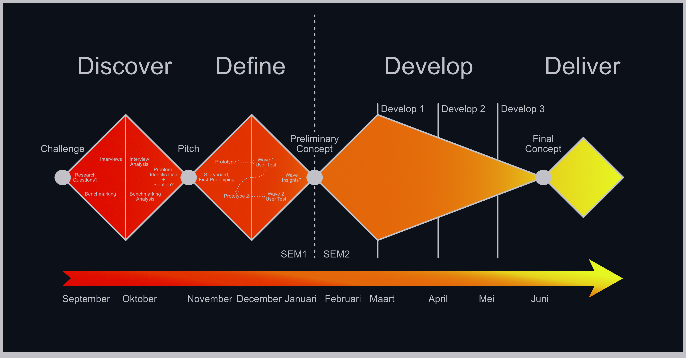

## Methodologie
Dit ontwerpproces maakt gebruik van een aangepaste versie van het klassieke Double Diamond model als methodiek, met als aanpassing dat er binnen elke stap ruimte is voor divergentie en convergentie (geïnspireerd door het Zendesk Triple Diamond Proces), aangezien het goed overeenstemt met de te behalen competenties binnenin gestelde timeframes. 

Het onderscheidt het ontwerpproces in 4 fases: Discover, Define, Develop & Deliver. 

---
### Discovery 

De Discover-fase heeft als doel binnenin de context van de challenge (Introductie) onderzoek te doen naar de wensen, noden, behoeftes en frustraties van de doelgroep (slechtzienden), alsook naar wat de markt nu al biedt en trends en tekortkomingen van deze bestaande producten (Divergentie), met als doel een specifieker probleem te identificeren, waarvoor nog geen (goede) oplossing aanwezig is. (Convergentie) 

De divergentie gebeurt doormiddel van: 

- Interviews (N = 4) 

  Slechtziende personen worden ondervraagd doormiddel van een semi-gestructureerd interview,
  met enkele relevante topics over levensstijl, frustraties, aankoopgedrag, mening over AI,
  etc. (Discovery Protocol) 

- Benchmarking (N = 10) 

  Bestaande producten op de markt worden onderzocht op basis van enkele eigenschappen zoals
  uitwerkingsvorm, type feedback en autonomie, met als doel trends (in tekortkoming) te
  identificeren. 

Op het specifieker probleem, geformuleerd bij de convergentie wordt een vroegtijdige, conceptuele oplossing uitgewerkt om te pitchen. 

### Definition 

De Definition-fase omvat het bedenken van mogelijke concepten die zouden kunnen antwoorden op het nieuw gesteld probleem.  

Het omvat: 

- Brainstormen: 

  1\. Wat moet het product kunnen? (Functies).
     _Aanvankelijk enigszins intuïtief, na testen concreter._
  2\. Hoe worden deze functies geïntegreerd in het product?
     (Vormgeving, simpliciteit, metaforen, etc.).
     _Rekening houdend met verworven inzichten uit Discovery. Constraint: ook bruikbaar zonder
     visual cues._ 

- Schetsen:
  Doel: ideeën communiceren met team, het vroegtijdig identificeren van
  denkfouten/verbeteringen, alsook bij verdere maturiteit van de schetsen modellen vormen om te
  materialiseren (Prototypes). 

- Prototypen:
  Quick & Dirty: worden gemaakt met low-cost materialen zoals karton en worden niet fijn
  afgewerkt. 
  Doel: problemen identificeren, een betere feeling van het concept krijgen, gebruiken bij
  tests om eigenschappen te valideren/verbeteren/elimineren. 

- Testen (N = 2):

  1\. Protocol opstellen (Protocol wave 1, Protocol wave 2).
     _Wat wordt getest? Op welke manier? Question Asking Protocol achteraf …_
  2\. Test uitvoeren 
  3\. Report opstellen (Report wave 1, Report wave 2)
     _Wat zijn de verworven inzichten? Is dit zoals verwacht? Waren er problemen? Implicaties
     voor design? …_ 

Dit proces wordt tijdens deze fase tweemaal uitgevoerd, onder de vorm van 2 waves. 

